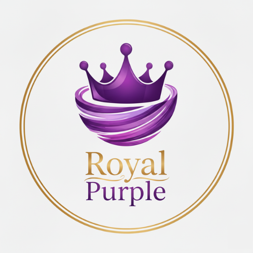

#  Sistema de Gestão para Açaíteria (Royal Purple)

## Integrantes:
- RANNYER GABRIEL DE OLIVEIRA
- GABRIEL AUGUSTO ROSISCA ISPER
## 1. Tema / Escopo

O projeto consiste no desenvolvimento de um sistema de gestão para uma açaíteria, com foco no controle de estoque, cadastro de produtos, categorias (tipo de item) e registro de vendas.
O sistema foi implementado utilizando Java com o framework Spring Boot, persistência de dados com JPA/Hibernate, banco de dados PostgreSQL, e controle de versionamento de scripts SQL com Flyway.

## 2. Estudos Realizados

Durante o desenvolvimento, foram aplicados os seguintes conceitos:

- Frameworks: uso do Spring Boot para abstrair a complexidade da configuração e acelerar o desenvolvimento.

- Programação em Camadas: o projeto foi estruturado em camadas:

- Controller: expõe endpoints REST.

- Service: contém as regras de negócio.

- Repository: camada de persistência de dados.

- Model: classes de domínio mapeadas para tabelas.

- Camada de Persistência: uso do Spring Data JPA para consultas e persistência automática.

- Framework ORM: utilização do Hibernate (via JPA) para mapeamento objeto-relacional.

- Conceitos de Anotações: uso de anotações do JPA (@Entity, @Table, @OneToOne, @ManyToOne, etc.) e do Spring (@Service, @RestController).

- Criação de Classes de Domínio (Modelo): foram implementadas as classes Produto, TipoItem, Estoque, Venda, ItemVenda, cada uma mapeando uma tabela do banco.

- Projeto Web com Frameworks: implementação de uma API REST com Spring Boot.

- Controle de versão do código: o projeto foi armazenado no GitHub.

- Migração de Banco: uso de Flyway para versionamento e criação das tabelas no banco.

## 3. Estrutura do Banco de Dados

O banco contém as seguintes tabelas:

- TipoItem – Define categorias dos produtos (ex: Açaí, Fruta, Cobertura).

- Produto – Representa itens do cardápio, vinculados ao TipoItem.

- Estoque – Controla a quantidade disponível de cada produto.

- Venda – Registra transações de vendas.

- ItemVenda – Detalha os produtos que compõem cada venda.

### Relacionamentos:

- TipoItem 1:N Produto

- Produto 1:1 Estoque

- Venda 1:N ItemVenda

- Produto 1:N ItemVenda

## 4. Funcionalidades

* Cadastro de Tipos de Item (categoria do produto).

* Cadastro de Produtos (nome, preço, tipo).

* Controle de Estoque (quantidade por produto, com CRUD completo).

* Registro de Vendas (data, valor total).

* Itens da Venda (produto, quantidade e preço unitário).

* API REST para consumo dos dados, permitindo integração com front-end futuro.

## 5. Tecnologias Utilizadas

- Linguagem: Java 17

- Framework Web: Spring Boot

- Persistência: Spring Data JPA / Hibernate

- Banco de Dados: PostgreSQL

- Versionamento de banco: Flyway

- IDE: IntelliJ IDEA

- Controle de Versão: Git/GitHub

## 6. Estrutura do Projeto

- Controller: classes responsáveis por expor endpoints REST (ProdutoController, EstoqueController, etc.).

- Service: classes de regra de negócio (ProdutoService, VendaService, etc.).

- Repository: interfaces de persistência (ProdutoRepository, VendaRepository, etc.).

- Model: classes de domínio mapeadas como entidades (Produto, Estoque, TipoItem, etc.).

- Migration: scripts SQL versionados pelo Flyway para criação das tabelas.

## 7. Conclusão

O sistema atende ao requisito mínimo de possuir 5 tabelas e uma movimentação (Venda). Foi implementado em camadas, utilizando conceitos modernos de frameworks, programação orientada a objetos, persistência com JPA, e versionamento de banco de dados.

Esse projeto pode ser expandido futuramente com a criação de um front-end web ou mobile, relatórios de vendas e controle de clientes.
